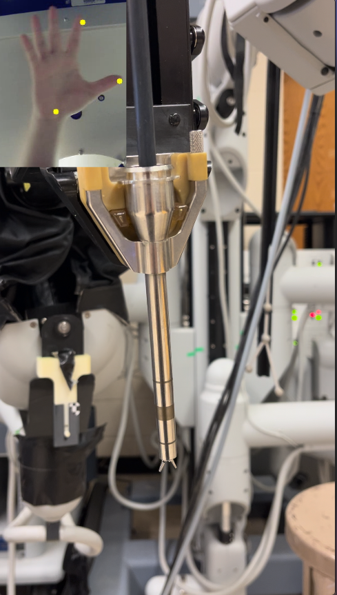
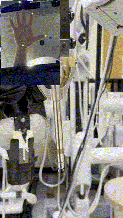
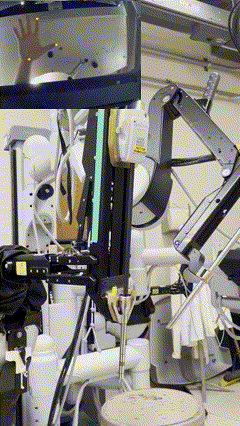

# Hand-Tracking Enabled DVRK Robot Motion Following Project



## Introduction
This project aims to develop a system where a DVRK (da Vinci Research Kit) robot can follow hand movements using hand tracking. The system utilizes a dataset obtained from https://github.com/hukenovs/hagrid. The code is based on TensorFlow 1.15 and ROS (Robot Operating System).

You can run hand tracking program in ```src/hand_follower/scripts/testing.py``` independently

## ROS Noetic Setup

### 1. Install ROS Noetic
Follow the official ROS installation guide for ROS Noetic: [ROS Noetic Installation Guide](http://wiki.ros.org/noetic/Installation)


### 2. Set ROS Environment
Add the following lines to your `~/.bashrc` file to automatically set up the ROS environment when opening a new terminal:
```bash
echo "source /opt/ros/noetic/setup.bash" >> ~/.bashrc
echo "source ~/catkin_ws/devel/setup.bash" >> ~/.bashrc
source ~/.bashrc
```

### 3. Test ROS Installation
Verify that ROS is installed and configured correctly by running:
```bash
roscore
```

## Install TensorFlow 1.15 or Higher

This guide provides instructions on how to install TensorFlow version 1.15 or a higher version on your system.

### 1. Create a Virtual Environment (Optional but Recommended)

It's good practice to create a virtual environment before installing TensorFlow to manage dependencies cleanly. You can use `virtualenv` or `conda` for this purpose.

For `virtualenv`, run the following commands:

```bash
# Install virtualenv if you haven't already
pip install virtualenv

# Create a virtual environment
virtualenv tf_env

# Activate the virtual environment
source tf_env/bin/activate
```

For `conda`, you can create an environment like this:

```bash
conda create -n tf_env python=3.8
conda activate tf_env
```

### 2. Install TensorFlow

#### For TensorFlow 1.15

```bash
pip install tensorflow==1.15
```

#### For TensorFlow 2.x (Higher Version)

```bash
pip install tensorflow
```

## Download repository
1. Clone the repository:
   ```bash
   git clone https://github.com/ElectricalHamster/H-DVRK.git
   ```
2. Navigate to the project directory:
   ```bash
   cd H-DVRK
   source devel/setup.bash
   ```
3. Connect with dvrk 
   ```bash
   qladisp
   qlacloserelays
   # Launch single arm with console:
   
   roslaunch cwru_dvrk_launch console_single_arm.launch [arm]:[sim]
   
   # Launch full system with console:
   
   roslaunch cwru_dvrk_launch console_full_system.launch [sim]
   
   ```
4. Run program in another
	Activate tensorflow environment
   ```bash
   source ~/tf_env/bin/activate
   cd H-DVRK/src/hand_follower
   chmod +x ~/H-DVRK/src/hand_follower/scripts/testing.py
   rosrun hand_follower testing.py
   ```
   
## Result
### Open & Close gripper

### Moving arm
