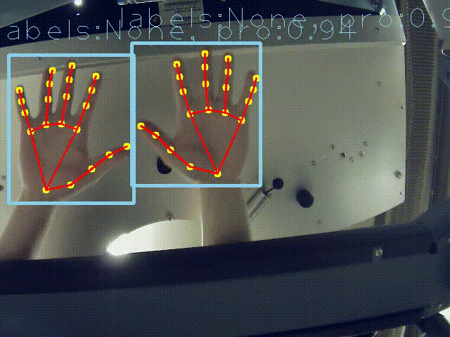
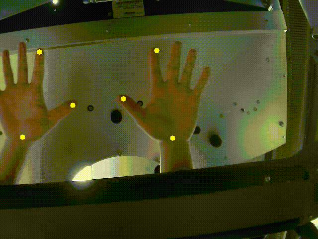

## Files Description
1. **functions.py**
   - Contains utility functions for robotic control, including a function that constructs and executes ROS commands based on input coordinates derived from gesture detection.

2. **gesture_landmark_labels_detector.py**
   - Implements a class `GestureLandmarkDetector` that loads a TensorFlow model and processes images to detect hand gestures. It returns detection boxes, confidence scores, and landmarks.

3. **Hand_tracking.pb**
   - A TensorFlow model file that contains the trained neural network for detecting hand gestures.

4. **testing.py**
   - A testing script that integrates video capture, gesture detection, and optional recording functionality. It demonstrates how the system can be used to interact with a robotic system based on real-time video input.

## Result of hand tracking

### The detection of 21 key points in each hand
If you want to test 21 hand's keypoints detection, please set ```whole_hand_detect = True```



If you want to test wrist's, index finger's and thumb's tip keypoints, please set ```whole_hand_detect = False```



